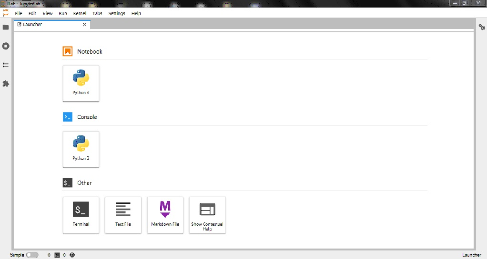

# ILab
ILab opens the IP and the port of your jupyterlab which has been opened on a server. You should only enter the IP and port of the JupyterLab which has been opened on your server.  
  
The only dependencies are PyQt5 and QWebEngineView. And for running it, just got line 15 of ILab.py and change "Your-IP" to your server's IP and "Your-port" to your JupyterLab's running port.
